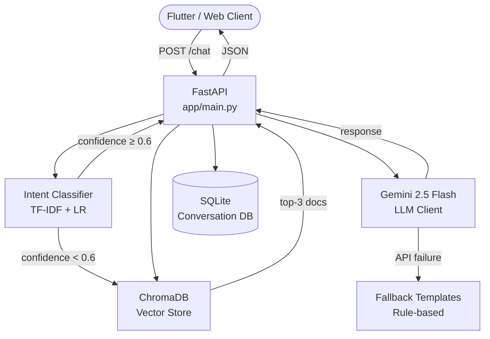

# Curify AI Advisor — Production AI Chatbot

[](https://github.com/YOUR_ORG/curify-ai-advisor/actions)
[](https://python.org)
[](https://fastapi.tiangolo.com)
[](LICENSE)

A **production-ready AI chatbot** for Curify customer support, featuring:

- 🤖 **ML intent classification** — TF-IDF + Logistic Regression (scikit-learn)
- 🔍 **RAG pipeline** — ChromaDB vector search + sentence-transformers embeddings
- ⚡ **Gemini 2.5 Flash** — response generation with retry + LRU cache
- 🗄️ **SQLite** — async conversation history via SQLAlchemy
- 🌐 **Tanglish support** — Tamil-English mixed input handled gracefully
- 🐳 **Docker-ready** — multi-stage build, named volumes, health checks
- 🔄 **CI/CD** — GitHub Actions (lint → test → build → deploy → weekly retrain)

---

## Architecture



---

## Project Structure

```
project/
├── app/
│   ├── main.py          # FastAPI app + all routes
│   ├── chatbot.py       # RAG pipeline orchestrator
│   ├── classifier.py    # TF-IDF + LR intent classifier
│   ├── embeddings.py    # sentence-transformers + ChromaDB interface
│   ├── llm_client.py    # Gemini 2.5 Flash wrapper (retry + LRU cache)
│   ├── database.py      # SQLAlchemy async ORM (User/Conversation/Message)
│   └── config.py        # Pydantic-settings environment config
├── data/
│   ├── raw/             # Source training CSVs
│   └── processed/       # Cleaned CSVs (auto-generated)
├── models/
│   ├── train.py         # Training orchestrator (CV + save + ChromaDB index)
│   └── saved/           # Trained model artefacts (joblib)
├── scripts/
│   ├── preprocess_data.py   # Data cleaning + validation
│   └── retrain_weekly.py    # Cron-ready retraining automation
├── tests/
│   ├── conftest.py          # pytest shared fixtures
│   ├── test_classifier.py   # Classifier unit tests
│   ├── test_chatbot.py      # RAG pipeline tests
│   └── test_api.py          # API integration tests
├── .github/workflows/
│   └── deploy.yml           # CI/CD pipeline
├── Dockerfile               # Multi-stage production build
├── docker-compose.yml       # App + persistent volumes
├── deploy.sh                # One-command local setup
├── pytest.ini               # pytest configuration
├── requirements.txt         # Pinned dependencies
└── .env.example             # Environment variable template
```

---

## Quick Start (Local)

### Option A: Using deploy.sh (recommended)

```bash
# Clone the project
git clone https://github.com/YOUR_ORG/curify-ai-advisor.git
cd curify-ai-advisor/project

# 1. Configure your environment
cp .env.example .env
# Edit .env and add your GEMINI_API_KEY

# 2. Train the model + start server (one command)
bash deploy.sh train

# Server starts at: http://localhost:8000
# API docs at:      http://localhost:8000/docs
```

### Option B: Manual Steps

```bash
# Create and activate virtual environment
python -m venv .venv
# Windows:
.venv\Scripts\activate
# macOS/Linux:
source .venv/bin/activate

# Install dependencies
pip install -r requirements.txt

# Configure environment
cp .env.example .env
# Edit .env — set GEMINI_API_KEY at minimum

# Create directories
mkdir -p models/saved chroma_db logs data/processed

# Step 1: (Optional) Preprocess training data
python scripts/preprocess_data.py

# Step 2: Train classifier + index ChromaDB
python models/train.py

# Step 3: Start the server
uvicorn app.main:app --host 0.0.0.0 --port 8000 --reload
```

---

## Docker Deployment

```bash
# Build and start
docker compose up -d --build

# Run initial training inside Docker
docker compose run --rm trainer

# Check health
curl http://localhost:8000/health

# View logs
docker compose logs -f app

# Stop
docker compose down
```

---

## API Reference

### `POST /chat`

Main chatbot endpoint. Runs the full RAG pipeline.

**Request:**
```json
{
  "user_id": "user_abc123",
  "message": "What is the price of Curify?"
}
```

**Response:**
```json
{
  "response": "Curify has three plans: Starter ₹999/mo...",
  "intent": "pricing",
  "confidence": 0.94,
  "fallback_used": false,
  "retrieval_used": true,
  "sources": [
    {
      "text": "How much does Curify cost?",
      "intent": "pricing",
      "similarity": 0.91,
      "doc_id": "doc_3"
    }
  ],
  "latency_ms": 1240,
  "conversation_id": "a3f2c1d4-..."
}
```

---

### `GET /health`

System health check.

```bash
curl http://localhost:8000/health
```

**Response:**
```json
{
  "status": "healthy",
  "app": "Curify AI Advisor",
  "version": "1.0.0",
  "classifier_trained": true,
  "known_intents": ["general_greeting", "pricing", ...],
  "chroma_docs": 50,
  "gemini_configured": true
}
```

---

### `POST /train` _(protected)_

Trigger model retraining. Requires `X-API-Key` header.

```bash
curl -X POST http://localhost:8000/train \
  -H "X-API-Key: your_train_api_key" \
  -H "Content-Type: application/json" \
  -d '{"reset_chroma": false}'
```

---

### `GET /history/{user_id}`

Retrieve paginated conversation history.

```bash
curl "http://localhost:8000/history/user_abc123?limit=10"
```

---

## Running Tests

```bash
# Full test suite
bash deploy.sh test

# Or manually
python -m pytest tests/ -v --tb=short

# With coverage report
python -m pytest tests/ --cov=app --cov-report=term-missing
```

---

## Supported Intents

| Intent | Example Messages |
|--------|-----------------|
| `general_greeting` | "Hello!", "Vanakkam!", "Hi there" |
| `product_inquiry` | "What does Curify do?", "Enna features irukku?" |
| `pricing` | "How much?", "Ethanai pairam?", "Plan details" |
| `order_status` | "Where is my order?", "Order track panna" |
| `complaint` | "App is broken", "Bug irukku" |
| `refund_request` | "I want a refund", "Paisa wapas" |
| `ai_advice` | "How can AI help?", "Business prediction" |
| `account_support` | "Can't login", "Password reset" |
| `general_farewell` | "Bye!", "Thanks, nandri" |
| `escalate_human` | "Talk to a human", "Aalunga koopdunga" |

---

## Environment Variables

| Variable | Required | Default | Description |
|----------|----------|---------|-------------|
| `GEMINI_API_KEY` | ✅ Yes | — | Gemini 2.5 Flash API key |
| `TRAIN_API_KEY` | ✅ Yes | `change_me` | API key for `/train` endpoint |
| `GEMINI_MODEL` | No | `gemini-2.5-flash` | Gemini model name |
| `DATABASE_URL` | No | `sqlite+aiosqlite:///./curify_chat.db` | Database connection URL |
| `CHROMA_PERSIST_DIR` | No | `./chroma_db` | ChromaDB persistence path |
| `CONFIDENCE_THRESHOLD` | No | `0.6` | Min classifier confidence before fallback |
| `TOP_K_RETRIEVAL` | No | `3` | ChromaDB retrieval top-K |
| `CORS_ORIGINS` | No | `http://localhost:3000,...` | Comma-separated allowed origins |
| `PORT` | No | `8000` | Server port |
| `ENVIRONMENT` | No | `development` | `development` / `production` |
| `DEBUG` | No | `true` | Enable debug logging |
| `LLM_CACHE_MAX_SIZE` | No | `256` | LRU cache size for LLM responses |
| `LLM_CACHE_TTL_SECONDS` | No | `300` | Cache TTL in seconds |
| `MIN_NEW_SAMPLES_FOR_RETRAIN` | No | `10` | Minimum new DB rows to trigger retrain |

---

## Manual Configuration Checklist

After cloning, configure the following manually:

- [ ] **GEMINI_API_KEY** — Get from [Google AI Studio](https://aistudio.google.com/)
- [ ] **TRAIN_API_KEY** — Set a strong random string (32+ chars)
- [ ] **CORS_ORIGINS** — Add your Flutter app / frontend origin
- [ ] **GitHub Secrets** (for CI/CD):
  - `GEMINI_API_KEY`
  - `TRAIN_API_KEY`
  - `DOCKER_USERNAME` + `DOCKER_PASSWORD`
  - `RENDER_DEPLOY_HOOK_URL` + `RENDER_APP_URL` (for Render deployment)
- [ ] **Weekly Cron** — The `.github/workflows/deploy.yml` handles this automatically. For server cron, add to crontab:
  ```
  0 2 * * 0 cd /app && python scripts/retrain_weekly.py >> logs/retrain.log 2>&1
  ```

---

## Tanglish (Tamil-English) Support

The classifier uses **character n-gram TF-IDF** (`char_wb`, ngram 2–4), which naturally handles:
- Tamil transliterated text: *"Vanakkam! Curify pathi sollunga"*
- Code-mixed sentences: *"Naan student discount vennum"*
- Hindi-English mix: *"Paisa wapas chahiye"*

No explicit language detection is needed — the character n-gram model is language-agnostic.

---

## License

MIT © 2026 Curify AI Team
